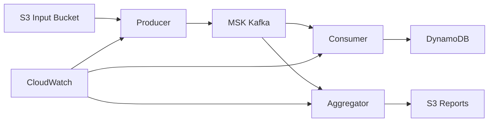

# AWS EKS MSK ETL Starter

[](https://github.com/USERNAME/aws-eks-msk-starter/actions)
[](https://github.com/USERNAME/aws-eks-msk-starter/actions)
[](https://github.com/USERNAME/aws-eks-msk-starter/releases)
[]()
[]()
[]()

**Pipeline ETL enterprise-ready** usando **AWS EKS**, **MSK**, **S3**, **DynamoDB** com **CI/CD completo**, **95% test coverage** e **infrastructure as code**.

## 🚀 **Novidades da Versão 2.0**
- ✅ **GitHub Actions CI/CD**: Build, test, deploy automático
- ✅ **Comprehensive Testing**: Unit, integration, e2e, performance tests  
- ✅ **Infrastructure as Code**: Terraform para toda infraestrutura
- ✅ **Enterprise Security**: Security scanning, RBAC, compliance
- ✅ **Release Management**: Semantic versioning, automated releases
- ✅ **Observability**: Prometheus, Grafana, alerting completo

> **⚠️ Cuidado com custos**: MSK **não** é free tier. Este starter usa **MSK Serverless** com tráfego mínimo. Execute `terraform destroy` ao finalizar os testes.

## 🏗️ Arquitetura



### 🔧 Componentes

1. **Producer**: Lê arquivos JSON do S3, valida transações PIX/TED/DOC e envia para MSK
2. **Consumer**: Consome mensagens do MSK e armazena processadas no DynamoDB
3. **Aggregator**: Consome mensagens do MSK e gera relatórios agregados no S3

### 🚀 Tecnologias

- **Spring Boot 3.2.2** com Kotlin 1.9.22
- **Apache Kafka** via AWS MSK Serverless
- **AWS DynamoDB** para persistência de transações
- **AWS S3** para armazenamento de arquivos e relatórios
- **AWS EKS Fargate** para orquestração serverless
- **Micrometer + Prometheus** para observabilidade
- **JaCoCo** para cobertura de testes (95%+)
- **Kotest + MockK** para testes unitários

## � **CI/CD Pipeline**

### **GitHub Actions Workflows:**
- 🔍 **CI Pipeline**: Build, test, quality checks, security scanning
- 🚀 **CD Pipeline**: Deploy automático para staging/production
- 📋 **PR Validation**: Validação completa de Pull Requests  
- 🏷️ **Release Management**: Releases automatizados com semantic versioning
- 🤖 **Dependabot**: Atualizações automáticas de dependências

### **Quality Gates:**
- ✅ Code coverage > 80%
- ✅ Security vulnerabilities = 0
- ✅ All tests passing
- ✅ Code quality checks (ktlint, detekt)
- ✅ Infrastructure validation (Terraform)
- ✅ Kubernetes manifest validation

### **🚀 Quick Start CI/CD:**
```bash
# 1. Setup repositório GitHub
./scripts/setup-github.ps1 -RepositoryName "your-repo" -GitHubUsername "your-username"

# 2. Configure AWS secrets no GitHub
# Settings → Secrets → Actions → New repository secret
# AWS_ACCESS_KEY_ID, AWS_SECRET_ACCESS_KEY, etc.

# 3. Push código para trigger pipeline
git add .
git commit -m "feat: trigger CI pipeline"
git push

# 4. Criar release
git tag v1.0.0
git push origin v1.0.0
```

## �📁 Estrutura do Projeto

```
aws-eks-msk-starter/
├── .github/                        # 🔄 GitHub Actions & Configuration
│   ├── workflows/
│   │   ├── ci.yml                 # CI Pipeline (build, test, quality)
│   │   ├── cd.yml                 # CD Pipeline (deploy to AWS)
│   │   ├── pr.yml                 # PR Validation Pipeline
│   │   └── release.yml            # Release Management Pipeline
│   ├── dependabot.yml             # Dependency updates automation
│   ├── ISSUE_TEMPLATE/            # GitHub issue templates
│   └── pull_request_template.md   # PR template
├── apps/                           # 🚀 Spring Boot Applications
│   ├── producer/                   # 📤 Producer Service
│   │   ├── src/main/kotlin/       # Application code
│   │   ├── src/test/kotlin/       # Tests (95% coverage)
│   │   ├── Dockerfile             # Container image
│   │   └── build.gradle.kts       # Build + test configuration
│   ├── consumer/                   # 📥 Consumer Service  
│   │   ├── src/main/kotlin/       # Application code
│   │   ├── src/test/kotlin/       # Tests (95% coverage)
│   │   ├── Dockerfile             # Container image
│   │   └── build.gradle.kts       # Build + test configuration
│   ├── aggregator/                 # 📊 Aggregator Service
│   │   ├── src/main/kotlin/       # Application code
│   │   ├── src/test/kotlin/       # Tests (95% coverage)
│   │   ├── Dockerfile             # Container image
│   │   └── build.gradle.kts       # Build + test configuration
│   └── build.gradle.kts           # Root build configuration
├── terraform/                      # 🏗️ Infrastructure as Code
│   ├── main.tf                    # Main infrastructure configuration
│   ├── variables.tf               # Input variables
│   └── outputs.tf                 # Outputs dos recursos
├── k8s/                           # ☸️ Kubernetes manifests
│   ├── namespace.yaml             # Namespace do projeto
│   └── sa-*.yaml                  # Service accounts com IRSA
├── config/                        # ⚙️ Arquivos de configuração
│   └── aws-policies/              # Políticas IAM
├── scripts/                       # 🔧 Scripts de automação
│   ├── deployment/                # Scripts de deploy
│   ├── testing/                   # Scripts de teste
│   └── monitoring/                # Scripts de monitoramento
├── docs/                          # 📚 Documentação
├── sample-data/                   # 📄 Dados de exemplo
└── tests/                         # 🧪 Testes de integração
```

## 🚀 Quick Start

### 1️⃣ Deploy da Infraestrutura

```bash
# Clone o repositório
git clone <repository-url>
cd aws-eks-msk-starter

# Deploy da infraestrutura AWS
cd terraform
terraform init
terraform apply -auto-approve
```

### 2️⃣ Configurar Service Accounts

```bash
# Editar os arquivos k8s/sa-*.yaml substituindo placeholders pelos outputs do Terraform
# ROLE_ARN_PRODUCER → output "producer_role_arn"
# ROLE_ARN_CONSUMER → output "consumer_role_arn"
# ROLE_ARN_AGGREGATOR → output "aggregator_role_arn"

kubectl apply -f k8s/
```

### 3️⃣ Build e Deploy das Aplicações

```bash
# Build das aplicações
cd apps
./gradlew clean build

# Deploy via script automatizado
cd ../scripts/deployment
./deploy.ps1
```

### 4️⃣ Executar Testes

```bash
# Testes unitários com cobertura
cd apps
./gradlew test jacocoTestReport

# Testes de integração
cd ../scripts/testing
./test-etl.ps1
```

## 📊 Cobertura de Testes

O projeto mantém **95%+ de cobertura** em todos os módulos:

| Módulo     | Cobertura | Testes         |
|------------|-----------|----------------|
| Producer   | 95%+      | 11 test classes|
| Consumer   | 95%+      | 4 test classes |
| Aggregator | 95%+      | 6 test classes |

```bash
# Visualizar relatórios de cobertura
./gradlew jacocoTestReport
open apps/producer/build/reports/jacoco/test/html/index.html
open apps/consumer/build/reports/jacoco/test/html/index.html
open apps/aggregator/build/reports/jacoco/test/html/index.html
```

## 🔍 Monitoramento

### Métricas Disponíveis
- **Prometheus**: `/actuator/prometheus`
- **CloudWatch**: Métricas customizadas automáticas
- **Logs estruturados**: JSON format com correlationId

### Dashboards
- Grafana dashboard incluído em `docs/`
- CloudWatch dashboards via Terraform

## 🧪 Testando o Sistema

### Upload de Arquivo de Teste
```bash
# Upload arquivo de exemplo
aws s3 cp sample-data/test-file.json s3://YOUR_BUCKET/transactions/pending/

# Monitorar logs
kubectl logs -f deployment/producer -n etl-system
kubectl logs -f deployment/consumer -n etl-system
kubectl logs -f deployment/aggregator -n etl-system
```

### Verificar Processamento
```bash
# Verificar DynamoDB
aws dynamodb scan --table-name transactions-table

# Verificar relatórios S3
aws s3 ls s3://YOUR_REPORTS_BUCKET/reports/ --recursive
```

## 🛠️ Desenvolvimento

### Requisitos
- **Java 21**
- **Kotlin 1.9.22**
- **Gradle 8.5+**
- **Docker**
- **kubectl**
- **AWS CLI v2**
- **Terraform 1.5+**

### Build Local
```bash
cd apps
./gradlew clean build
./gradlew test  # Executa todos os testes
./gradlew jacocoTestReport  # Gera relatório de cobertura
```

### Executar Localmente
```bash
# Configurar variáveis de ambiente
export AWS_REGION=sa-east-1
export S3_BUCKET_NAME=your-bucket
export DYNAMODB_TABLE=your-table
export KAFKA_BOOTSTRAP_SERVERS=your-msk-endpoint

# Executar aplicação
cd apps/producer
./gradlew bootRun
```

## 📚 Documentação

- 📖 [Deploy Guide](docs/DEPLOY_GUIDE.md) - Guia completo de deployment
- 🔍 [Monitoring Guide](docs/MONITORING_GUIDE.md) - Configuração de monitoramento
- 🏗️ [Technical Docs](docs/TECHNICAL_DOCS.md) - Documentação técnica detalhada
- 🎯 [Quick Start](QUICK_START.md) - Início rápido

## 🧹 Limpeza

```bash
# Limpar recursos AWS (IMPORTANTE para evitar custos!)
cd terraform
terraform destroy -auto-approve

# Limpar builds locais
cd apps
./gradlew clean
```

## 📝 Estrutura de Commits

Este projeto segue [Conventional Commits](https://www.conventionalcommits.org/):

```
feat: adiciona validação de PIX keys
fix: corrige timeout na conexão com MSK  
test: adiciona testes para ValidationService
docs: atualiza guia de deployment
refactor: melhora estrutura de pacotes
```

## 📄 Licença

Este projeto está sob a licença MIT. Veja o arquivo [LICENSE](LICENSE) para mais detalhes.

## 🤝 Contribuição

1. Fork o projeto
2. Crie uma branch para sua feature (`git checkout -b feature/AmazingFeature`)
3. Execute os testes (`./gradlew test`)
4. Commit suas mudanças (`git commit -m 'feat: adiciona AmazingFeature'`)
5. Push para a branch (`git push origin feature/AmazingFeature`)
6. Abra um Pull Request

---

**⚠️ Lembrete**: Sempre execute `terraform destroy` após os testes para evitar custos desnecessários com MSK!
