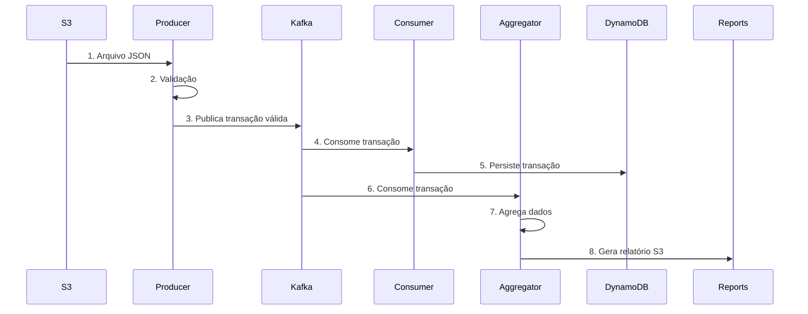

# Arquitetura e Estrutura do Projeto

## 🏗️ Arquitetura Hexagonal

O projeto segue os princípios da **Arquitetura Hexagonal** (Ports & Adapters), separando claramente as responsabilidades:

### Estrutura de Pacotes por Módulo

```
br.com.itau.etl.{module}/
├── config/          # 🔧 Configurações (Beans, Properties)
├── model/           # 📋 Modelos de domínio  
├── service/         # 🔄 Lógica de negócio
├── listener/        # 👂 Adaptadores de entrada (Kafka)
└── {Module}Application.kt  # 🚀 Classe principal
```

### Padrões de Design Utilizados

#### 1. **Dependency Injection** (Spring Framework)
- Todas as dependências são injetadas via `@Autowired`
- Configurações centralizadas em classes `@Configuration`
- Beans específicos para cada responsabilidade

#### 2. **Strategy Pattern** (Validações)
```kotlin
// ValidationService usa diferentes estratégias de validação
interface ValidationStrategy {
    fun validate(transaction: Transaction): List<String>
}

class PixValidationStrategy : ValidationStrategy
class AmountValidationStrategy : ValidationStrategy
```

#### 3. **Observer Pattern** (Kafka Listeners)
```kotlin
@KafkaListener(topics = ["transactions"])
class TransactionKafkaListener {
    fun consume(@Payload message: String) { /* ... */ }
}
```

#### 4. **Repository Pattern** (Data Access)
```kotlin
@Service
class DynamoDbService {
    fun save(entity: ProcessedTransaction)
    fun findById(id: String): ProcessedTransaction?
}
```

## 📦 Separação de Responsabilidades

### Producer Module
```
producer/
├── config/
│   ├── AwsConfig.kt           # Configuração de clientes AWS
│   ├── KafkaProducerConfig.kt # Configuração do Kafka Producer  
│   └── MetricsConfig.kt       # Configuração de métricas
├── service/
│   ├── S3Service.kt           # Operações com S3
│   ├── ValidationService.kt   # Validações de negócio
│   ├── KafkaProducerService.kt # Envio para Kafka
│   ├── FileProcessorService.kt # Orquestração do processamento
│   ├── DynamoDbService.kt     # Controle de arquivos processados
│   └── ConfigurationService.kt # Configurações dinâmicas (SSM)
├── model/
│   └── Transaction.kt         # Modelos de domínio
└── ProducerApplication.kt     # Aplicação principal
```

**Responsabilidades:**
- ✅ Ler arquivos do S3
- ✅ Validar transações PIX/TED/DOC
- ✅ Publicar mensagens no Kafka
- ✅ Controlar duplicações via DynamoDB
- ✅ Métricas e logs estruturados

### Consumer Module
```
consumer/
├── config/
│   ├── AwsConfig.kt           # Configuração de clientes AWS
│   ├── KafkaConsumerConfig.kt # Configuração do Kafka Consumer
│   └── MetricsConfig.kt       # Configuração de métricas
├── service/
│   ├── TransactionProcessorService.kt # Processamento de transações
│   └── DynamoDbService.kt     # Persistência no DynamoDB
├── listener/
│   └── TransactionKafkaListener.kt # Listener Kafka
├── model/
│   └── Transaction.kt         # Modelos de domínio + ProcessedTransaction
└── ConsumerApplication.kt     # Aplicação principal
```

**Responsabilidades:**
- ✅ Consumir mensagens do Kafka
- ✅ Processar e enriquecer transações
- ✅ Persistir no DynamoDB
- ✅ Controle de idempotência
- ✅ Tratamento de erros e reprocessamento

### Aggregator Module
```
aggregator/
├── config/
│   ├── AwsConfig.kt           # Configuração de clientes AWS
│   ├── KafkaConsumerConfig.kt # Configuração do Kafka Consumer
│   └── MetricsConfig.kt       # Configuração de métricas
├── service/
│   ├── TransactionAggregatorService.kt # Agregação em memória
│   ├── ReportService.kt       # Geração de relatórios
│   └── ReportSchedulerService.kt # Agendamento de relatórios
├── listener/
│   └── TransactionKafkaListener.kt # Listener Kafka
├── model/
│   └── Transaction.kt         # Modelos + TransactionSummary
└── AggregatorApplication.kt   # Aplicação principal
```

**Responsabilidades:**
- ✅ Consumir mensagens do Kafka
- ✅ Agregar dados por período (horário)
- ✅ Gerar relatórios em JSON/CSV
- ✅ Salvar relatórios no S3
- ✅ Estatísticas PIX por tipo de chave

## 🔄 Fluxo de Dados



## 📊 Padrões de Configuração

### 1. Profiles Spring
```yaml
# application.yml (comum)
spring:
  profiles:
    active: ${SPRING_PROFILES_ACTIVE:dev}
---
# application-dev.yml
spring:
  kafka:
    bootstrap-servers: localhost:9092
---  
# application-prod.yml  
spring:
  kafka:
    bootstrap-servers: ${MSK_BOOTSTRAP_SERVERS}
```

### 2. Configurações Externalizadas
```kotlin
@ConfigurationProperties(prefix = "app")
data class ApplicationProperties(
    val s3: S3Properties,
    val dynamodb: DynamoDbProperties,
    val kafka: KafkaProperties
) {
    data class S3Properties(
        val bucketName: String,
        val pendingPrefix: String
    )
}
```

### 3. Feature Flags via SSM
```kotlin
@Service
class ConfigurationService {
    fun getPixEnabled(): Boolean = 
        ssmClient.getParameter("app.features.pix-enabled")
}
```

## 🧪 Estratégia de Testes

### Estrutura de Testes
```
src/test/kotlin/
├── {package}/service/      # Testes unitários dos services
├── {package}/config/       # Testes das configurações
├── {package}/model/        # Testes dos modelos
├── {package}/listener/     # Testes dos listeners
└── resources/
    └── application-test.properties
```

### Padrões de Teste Utilizados
1. **AAA Pattern** (Arrange, Act, Assert)
2. **BDD Style** com Kotest (Describe/Context/It)
3. **Mocking** completo de dependências externas
4. **Test Containers** para testes de integração

### Cobertura de Cenários
- ✅ **Happy Path** - Fluxos principais
- ✅ **Error Handling** - Tratamento de erros
- ✅ **Edge Cases** - Casos limites
- ✅ **Integration** - Testes de integração com Spring Context

## 🔍 Observabilidade

### Métricas Customizadas
```kotlin
@Bean
fun transactionsProcessedCounter(meterRegistry: MeterRegistry): Counter =
    Counter.builder("etl.transactions.processed")
        .description("Total transactions processed")
        .register(meterRegistry)
```

### Logs Estruturados
```kotlin
private val logger = KotlinLogging.logger {}

// Com contexto estruturado
logger.info { "Processing file" }
    .addKeyValue("fileName", fileName)
    .addKeyValue("fileSize", fileSize)
    .log()
```

### Health Checks
```kotlin
@Component
class KafkaHealthIndicator : HealthIndicator {
    override fun health(): Health {
        return if (kafkaIsHealthy()) {
            Health.up().build()
        } else {
            Health.down().withDetail("kafka", "Connection failed").build()
        }
    }
}
```

## 📈 Performance e Escalabilidade

### Configurações Kafka
```kotlin
// Producer: Alta performance + garantia de entrega
ProducerConfig.ACKS_CONFIG to "all"
ProducerConfig.RETRIES_CONFIG to 3
ProducerConfig.ENABLE_IDEMPOTENCE_CONFIG to true

// Consumer: Processamento em lote
ConsumerConfig.MAX_POLL_RECORDS_CONFIG to 100
ConsumerConfig.FETCH_MIN_BYTES_CONFIG to 1024
```

### Agregação Eficiente
```kotlin
// Buffer em memória com ConcurrentHashMap
private val transactionBuffer = ConcurrentHashMap<String, MutableList<Transaction>>()

// Processamento assíncrono com @Async
@Async
suspend fun processTransactionBatch(transactions: List<Transaction>)
```

### Resource Management
```kotlin
// Connection pooling para DynamoDB
@Bean
fun dynamoDbClient(): DynamoDbClient = 
    DynamoDbClient.builder()
        .overrideConfiguration { it.maxConcurrency(50) }
        .build()
```

## 🛡️ Tratamento de Erros

### Estratégia de Retry
```kotlin
@Retryable(
    value = [RuntimeException::class],
    maxAttempts = 3,
    backoff = Backoff(delay = 1000)
)
fun processWithRetry(transaction: Transaction)
```

### Circuit Breaker
```kotlin
@CircuitBreaker(name = "dynamodb")
fun saveToDynamoDB(transaction: ProcessedTransaction)
```

### Dead Letter Queue
```kotlin
@KafkaListener(topics = ["transactions.dlq"])
fun handleFailedMessage(message: String) {
    // Log e alertas para mensagens que falharam múltiplas vezes
}
```

Esta arquitetura garante **alta coesão**, **baixo acoplamento** e **facilidade de teste e manutenção**.
