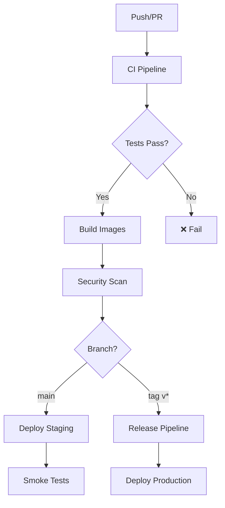

# 🚀 Guia Completo: GitHub & CI/CD Setup

## 📋 **VISÃO GERAL**

Este guia fornece instruções completas para configurar o projeto no GitHub com pipelines de CI/CD automatizados usando GitHub Actions.

### **🎯 O Que Foi Configurado**

- ✅ **CI Pipeline**: Build, test, quality checks, security scanning
- ✅ **CD Pipeline**: Deploy automático para staging/production
- ✅ **PR Validation**: Validação completa de Pull Requests
- ✅ **Release Management**: Releases automatizados com versionamento semântico
- ✅ **Dependency Management**: Dependabot para atualizações automáticas
- ✅ **Quality Gates**: Code quality, security, documentation checks

---

## 🏗️ **ESTRUTURA DE WORKFLOWS**

### **📁 Workflows Criados**

```
.github/
├── workflows/
│   ├── ci.yml           # 🔍 Continuous Integration
│   ├── cd.yml           # 🚀 Continuous Deployment  
│   ├── pr.yml           # 📋 Pull Request Validation
│   └── release.yml      # 🏷️ Release Management
├── dependabot.yml       # 🤖 Dependency Updates
└── ISSUE_TEMPLATE/      # 📝 Issue Templates (opcional)
```

### **🔄 Pipeline Flow**



---

## 🚀 **PASSO A PASSO: SETUP INICIAL**

### **1. Criar Repositório no GitHub**

```bash
# 1. Criar repositório no GitHub (via web interface)
# 2. Clone local (se ainda não tiver)
git clone https://github.com/SEU_USERNAME/aws-eks-msk-starter.git
cd aws-eks-msk-starter

# 3. Adicionar arquivos se necessário
git add .
git commit -m "feat: initial project structure with CI/CD"
git push -u origin main
```

### **2. Configurar Secrets no GitHub**

Vá em **Settings → Secrets and variables → Actions** e adicione:

#### **🔐 AWS Secrets**
```bash
AWS_ACCESS_KEY_ID          # AWS Access Key para deploy
AWS_SECRET_ACCESS_KEY      # AWS Secret Key para deploy
AWS_ACCOUNT_DEV            # Account ID para desenvolvimento
AWS_ACCOUNT_STAGING        # Account ID para staging  
AWS_ACCOUNT_PROD           # Account ID para produção
TERRAFORM_STATE_BUCKET     # S3 bucket para Terraform state
```

#### **🔧 Tool Secrets**
```bash
SONAR_TOKEN               # SonarCloud token (opcional)
CODECOV_TOKEN             # Codecov token (opcional)
SLACK_WEBHOOK_URL         # Slack notifications (opcional)
```

### **3. Configurar Branch Protection**

Em **Settings → Branches**, adicione regras para `main`:

- ✅ **Require pull request reviews before merging**
- ✅ **Require status checks to pass before merging**
  - ✅ Code Quality
  - ✅ Unit Tests
  - ✅ Build Verification
  - ✅ Security Scan
- ✅ **Require branches to be up to date before merging**
- ✅ **Require linear history**
- ✅ **Include administrators**

---

## 🔍 **CI PIPELINE DETALHADO**

### **Triggers:**
- Push para `main`, `develop`, `feature/*`
- Pull Requests para `main`, `develop`  
- Manual dispatch

### **Jobs Executados:**

#### **1. 🔍 Code Quality (5-8 min)**
```yaml
- Ktlint (Kotlin style)
- Detekt (static analysis)  
- SonarQube scan
- Dependency vulnerability check
```

#### **2. 🧪 Unit Tests (3-5 min por módulo)**
```yaml
- Producer tests
- Consumer tests  
- Aggregator tests
- Coverage report (Jacoco)
```

#### **3. 🔗 Integration Tests (8-12 min)**
```yaml
- TestContainers (Kafka, LocalStack)
- End-to-end pipeline test
- AWS services integration
```

#### **4. 🐳 Build & Push Images (6-10 min)**
```yaml
- Docker build (multi-arch)
- Security scan (Trivy)  
- Push to GHCR registry
```

#### **5. ✅ Validation (2-3 min)**
```yaml
- Kubernetes manifest validation
- Terraform syntax check
- Deployment readiness check
```

---

## 🚀 **CD PIPELINE DETALHADO**

### **Environments:**
- 🧪 **Development**: Feature branches
- 🎭 **Staging**: Main branch  
- 🏭 **Production**: Release tags

### **Deploy Flow:**

#### **1. 🏗️ Infrastructure (Terraform)**
```yaml
- Plan infrastructure changes
- Apply infrastructure updates
- Capture outputs (cluster name, endpoints)
```

#### **2. 🚀 Application Deployment**
```yaml
- Update kubectl config
- Deploy applications (rolling update)
- Wait for rollout completion
- Health checks
```

#### **3. 💨 Smoke Tests**
```yaml
- Pod readiness checks
- Service health endpoints
- Basic functionality validation
```

#### **4. 🛡️ Security Validation**
```yaml
- Pod security context check
- Network policy validation  
- RBAC verification
```

---

## 📋 **PR VALIDATION PIPELINE**

### **Execução Inteligente:**
- Detecta mudanças (código, infra, k8s, docs)
- Executa apenas testes relevantes
- Lightweight integration tests

### **Validações Realizadas:**

#### **📊 Para Mudanças de Código:**
- Code quality (ktlint, detekt)
- Unit tests com coverage
- Build verification  
- Security scan (dependencies)
- Lightweight integration tests

#### **🏗️ Para Mudanças de Infraestrutura:**
- Terraform format check
- Terraform validate
- Terraform plan (comentado no PR)

#### **⚓ Para Mudanças de Kubernetes:**
- Manifest validation (kubectl --dry-run)
- Kubeval validation
- Polaris security scan

#### **📝 Para Mudanças de Documentação:**
- Markdown lint
- Link validation  
- Documentation coverage check

---

## 🏷️ **RELEASE MANAGEMENT**

### **Semantic Versioning:**
- `v1.0.0` - Major release
- `v1.1.0` - Minor release  
- `v1.0.1` - Patch/hotfix

### **Release Process:**

#### **1. Criar Release (Manual ou Automático)**
```bash
# Via GitHub Actions (Manual Dispatch)
# Ou push de tag
git tag v1.0.0
git push origin v1.0.0
```

#### **2. Automação Executada:**
- Build release artifacts
- Security scan completo
- Generate release notes
- Create GitHub release
- Deploy to production (se não for hotfix)
- Update documentation

### **Release Notes Automáticas:**
- Features (commits com "feat")
- Bug fixes (commits com "fix")
- Improvements (commits com "improve") 
- Statistics (commits, contributors, files)
- Docker image tags
- Installation instructions

---

## 🤖 **DEPENDABOT CONFIGURATION**

### **Atualizações Automáticas:**
- **Segunda**: Gradle dependencies
- **Terça**: Docker base images
- **Quarta**: Terraform providers
- **Quinta**: GitHub Actions

### **Configurações:**
- Máximo 10 PRs abertos
- Reviewers automáticos
- Labels automáticas
- Ignore major updates para Spring Boot/Kotlin

---

## 📊 **MONITORAMENTO & MÉTRICAS**

### **GitHub Actions Insights:**
- Build success rate
- Test duration trends  
- Deployment frequency
- Lead time metrics

### **Quality Gates:**
- Code coverage > 80%
- Security vulnerabilities = 0
- All tests passing
- Documentation up-to-date

### **Notifications (Slack):**
- CI failures
- Deployment status
- Release announcements
- Security alerts

---

## 🛠️ **COMANDOS ÚTEIS**

### **Executar Workflows Localmente:**
```bash
# Instalar act (GitHub Actions local runner)
# https://github.com/nektos/act

# Executar CI workflow
act push

# Executar PR workflow  
act pull_request

# Executar com secrets
act -s GITHUB_TOKEN=xxx
```

### **Debugging Workflows:**
```bash
# Ver logs de workflow
gh run list
gh run view RUN_ID
gh run view RUN_ID --log

# Re-executar workflow
gh run rerun RUN_ID

# Cancelar workflow
gh run cancel RUN_ID
```

### **Gestão de Releases:**
```bash
# Listar releases
gh release list

# Criar release manual
gh release create v1.0.0 --title "Release v1.0.0" --notes "Release notes"

# Download release assets
gh release download v1.0.0
```

---

## 🔧 **CONFIGURAÇÃO DE DESENVOLVIMENTO**

### **Git Hooks (Opcional):**
```bash
# Configurar pre-commit hooks
pip install pre-commit
pre-commit install

# .pre-commit-config.yaml
repos:
  - repo: https://github.com/pre-commit/pre-commit-hooks
    rev: v4.4.0
    hooks:
      - id: trailing-whitespace
      - id: end-of-file-fixer
      - id: check-merge-conflict
```

### **IDE Configuration:**
```bash
# VS Code extensions recomendadas
.vscode/extensions.json:
{
  "recommendations": [
    "ms-vscode.vscode-github-actions",
    "github.vscode-pull-request-github", 
    "hashicorp.terraform",
    "ms-kubernetes-tools.vscode-kubernetes-tools"
  ]
}
```

---

## 🚨 **TROUBLESHOOTING**

### **Problemas Comuns:**

#### **❌ CI Failing:**
```bash
# 1. Verificar logs detalhados
gh run view --log

# 2. Executar testes localmente
cd apps && ./gradlew test

# 3. Verificar formato do código
./gradlew ktlintFormat
```

#### **❌ Deploy Failing:**
```bash
# 1. Verificar secrets AWS
aws sts get-caller-identity

# 2. Verificar permissões EKS
aws eks describe-cluster --name CLUSTER_NAME

# 3. Verificar imagens Docker
docker pull ghcr.io/REPO/app:TAG
```

#### **❌ Tests Flaky:**
```bash
# 1. Executar múltiplas vezes
./gradlew test --rerun-tasks

# 2. Verificar TestContainers
docker ps
docker logs CONTAINER_ID
```

### **Performance Optimization:**

#### **⚡ Cache Configuration:**
- Gradle build cache habilitado
- Docker layer caching
- Dependency caching
- Test result caching

#### **⚡ Parallel Execution:**
- Matrix strategy para jobs independentes
- Parallelização de testes Gradle
- Multi-stage Docker builds

---

## 📈 **MÉTRICAS & KPIs**

### **Deployment Metrics:**
- **Deployment Frequency**: Diário (target)
- **Lead Time**: < 4 horas (commit to production)
- **MTTR**: < 2 minutos (rollback time)  
- **Change Failure Rate**: < 2%

### **Quality Metrics:**
- **Test Coverage**: > 80%
- **Code Duplication**: < 5%
- **Technical Debt**: < 8 hours
- **Security Vulnerabilities**: 0 high/critical

### **Team Metrics:**
- **PR Review Time**: < 24 horas
- **Build Success Rate**: > 95%
- **Hotfix Frequency**: < 5% de releases

---

## 🎯 **PRÓXIMOS PASSOS**

### **Melhorias Futuras:**
1. **Progressive Deployment**: Blue-green, canary
2. **Chaos Engineering**: Chaos Monkey integration
3. **Performance Testing**: Load tests automáticos
4. **Multi-region**: Cross-region deployment
5. **Compliance**: SOC2, PCI-DSS automation

### **Integrations:**
- **Jira**: Issue linking
- **Confluence**: Documentation sync
- **Datadog**: Advanced monitoring
- **PagerDuty**: Incident management

---

## ✅ **CHECKLIST DE SETUP**

### **Pré-requisitos:**
- [ ] ✅ Repositório GitHub criado
- [ ] ✅ AWS accounts configurados
- [ ] ✅ Terraform state bucket criado
- [ ] ✅ Docker registry configurado

### **Configuração GitHub:**
- [ ] ✅ Secrets configurados
- [ ] ✅ Branch protection habilitado
- [ ] ✅ Teams e permissões definidos
- [ ] ✅ Issue templates criados

### **Workflow Testing:**
- [ ] ✅ CI pipeline executado com sucesso
- [ ] ✅ PR validation testado
- [ ] ✅ CD pipeline validado em staging
- [ ] ✅ Release process testado

### **Monitoramento:**
- [ ] ✅ Slack notifications configuradas  
- [ ] ✅ Dashboard de métricas criado
- [ ] ✅ Alertas configurados
- [ ] ✅ Documentation atualizada

**🎉 Setup Completo! Sua pipeline de CI/CD está pronta para uso! 🚀**
